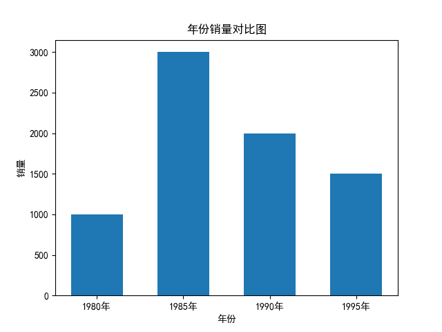
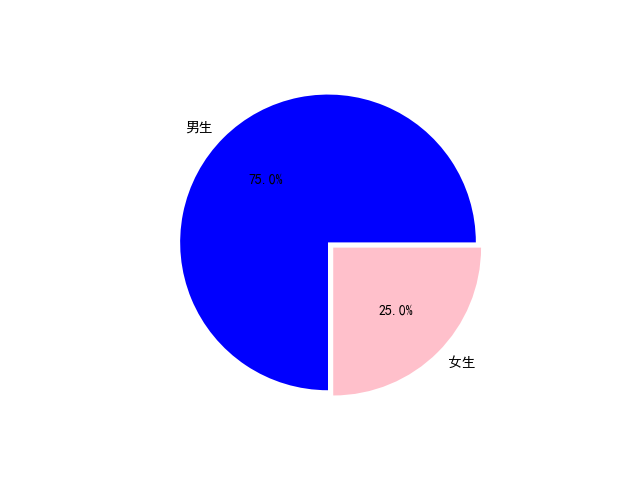

## 张翔宇周总结：

### **Matplotlib**

Matplotlib 是一个Python的 2D绘图库。通过 Matplotlib，开发者可以仅需要几行代码，便可以生成绘图，直方图，功率谱，条形图，错误图，散点图等。

通过学习Matplotlib，可让数据可视化，更直观的真实给用户。使数据更加客观、更具有说服力。 Matplotlib是Python的库，又是开发中常用的库。

#### 1.**绘制基础**

在使用Matplotlib绘制图形时，其中有两个最为常用的场景。一个是画点，一个是画线。pyplot基本方法的使用如下表。

| 方法名                           | 说明                           |
| -------------------------------- | ------------------------------ |
| title()                          | 设置图表的名称                 |
| xlabel()                         | 设置x轴名称                    |
| ylabel()                         | 设置y轴名称                    |
| xticks(x,ticks,rotation)         | 设置x轴的刻度,rotation旋转角度 |
| yticks()                         | 设置y轴的刻度                  |
| plot()                           | 绘制线性图表                   |
| show()                           | 显示图表                       |
| legend()                         | 显示图例                       |
| text(x,y,text)                   | 显示每条数据的值  x,y值的位置  |
| figure(name,figsize=(w,h),dpi=n) | 设置图片大小                   |

#### 2.**绘制直线**

在使用Matplotlib绘制线性图时，其中最简单的是绘制线图。在下面的实例代码中，使用Matplotlib绘制了一个简单的直线。具体实现过程如下：

（1） 导入模块pyplot，并给它指定别名plt，以免反复输入pyplot。在模块pyplot中包含很多用于生产图表的函数。

（2） 将绘制的直线坐标传递给函数plot()。

（3） 通过函数plt.show()打开Matplotlib查看器，显示绘制的图形。

##### 【示例】根据两点绘制一条线

```python
# 导入matplotlib中的绘图模块pyplot,并且重新命名为plt,防止多次导入
import matplotlib.pyplot as plt

# 具体坐标
x = [1, 2]
y = [4, 8]

# 绘制
plt.plot(x, y)
# 进行展示
plt.show()
```


#### 3.**绘制折线**

##### 【示例】绘制折线图

```python
import matplotlib.pyplot as plt


x = [1, 2, 3, 4, 5]
y = [1, 4, 9, 16, 25]

plt.plot(x, y)
plt.show()
```


#### 3.**设置标签文字和线条粗细**

在上面的实例直线结果不够完美，开发者可以绘制的线条样式进行灵活设置。例如：可以设置线条的粗细、设置文字等。

##### 【示例】绘制折线图并设置样式

```python
import matplotlib.pyplot as plt

x = [1, 2, 3, 4, 5]
y = [1, 4, 9, 16, 25]


# 可以通过添加linewidth，来设置线条宽度
plt.plot(x, y, linewidth=10)

# xlabel可以设置x轴名称
plt.xlabel("x")
# ylabel可以设置y轴名称
plt.ylabel("y=x^2")

plt.rcParams['font.sans-serif']=['SimHei'] #用来正常显示中文标签
# title可以设置标题
plt.title("折线图")

plt.show()
```


Matplotlib 默认情况不支持中文，我们可以使用以下简单的方法来解决：

```python
plt.rcParams['font.sans-serif']=['SimHei'] # 用来正常显示中文标签
```

#### 4.绘制一元二次方程的曲线y=x^2

Matplotlib有很多函数用于绘制各种图形，其中plot函数用于曲线，需要将200个点的x坐标和Y坐标分别以序列的形式传入plot函数，然后调用show函数显示绘制的图形。一元二次方程的曲线

##### 【示例】一元二次方程的曲线

```python
import matplotlib.pyplot as plt

x = range(-100, 100)
y = [i**2 for i in x]

plt.plot(x, y)

# 将生成的图片进行保存,默认保存成png格式
plt.savefig("result")

# 也可以指定格式
plt.savefig("result.jpg")
# 应该在展示之前，进行保存图片操作

plt.show()
```


#### 5.**绘制正弦曲线和余弦曲线**

使用plt函数绘制任何曲线的第一步都是生成若干个坐标点（x,y），理论上坐标点是越多越好。本例取0到10之间100个等差数作为x的坐标，然后将这100个x坐标值一起传入Numpy的sin和cos函数，就会得到100个y坐标值，最后就可以使用plot函数绘制正弦曲线和余弦曲线。

【示例】正弦曲线和余弦曲线

```python
import matplotlib.pyplot as plt
# 导入numpy这种关于数学的库，并且重新命名为np,防止多次导入
import numpy as np

# 生成0到10之间，100个数
x = np.linspace(0, 10, 100)
sin_y = np.sin(x)

# 绘制sin
plt.plot(x, sin_y)
# 绘制cos
cos_y = np.cos(x)
plt.plot(x, cos_y)
plt.savefig("sin_cos.jpg")
plt.show()
```


如果想绘制到两张画布中，可以调用subplot()函数将画布分区。

##### 【示例】将画布分为区域，将图画到画布的指定区域

```python
import matplotlib.pyplot as plt
import numpy as np

x = np.linspace(0, 10, 100)

# 分区并确定放在哪个位置
plt.subplot(2, 2, 1)
# 调整x轴和y轴的范围
plt.xlim(0, 20)
plt.ylim(-2, 2)
plt.plot(x, np.sin(x))

plt.subplot(2, 2, 2)
plt.plot(x, np.cos(x))

plt.show()
```


#### 6.**散点图**

使用scatter函数可以绘制随机点，该函数需要接收x坐标和y坐标的序列。

##### 【示例】sin函数的散点图

```python
import matplotlib.pyplot as plt
import numpy as np


x = np.linspace(0, 10, 100)
sin_y =np.sin(x)


# plt.plot(x, sin_y, "o")

plt.scatter(x, sin_y)
# 使用plot或scatter绘制出来的图像都是一样的，plot绘制速度快与scatter
# 绘制不同形式（颜色、大小）的点时，使用scatter
plt.show()
```


##### 【示例】使用scatter画100种大小和颜色都不相同的散点图

```python
import matplotlib.pyplot as plt
import numpy as np

# 保证每次产生的随机数一样
np.random.seed(0)

x = np.random.rand(100)
y = np.random.rand(100)

# 设置点的大小
size = np.random.rand(100)*1000
# 设置点的颜色
color = np.random.rand(100)*1000

# 设置散点图中的形式（大小、颜色、透明度），用scatter
# 参数里面写上s c alpha
plt.scatter(x, y, s=size, c=color, alpha=0.9)
# 果然是逐行解释，逐行执行
# Python是脚本语言，编译型语言的话，就是全局进行编译，进行执行了
plt.show()
print(x)
```


作为线性图的替代，可以通过向 plot() 函数添加格式字符串来显示离散值。 可以使用以下格式化字符。

| 字符 | 描述         |
| ---- | ------------ |
| '-'  | 实线样式     |
| '--' | 短横线样式   |
| '-.' | 点划线样式   |
| ':'  | 虚线样式     |
| '.'  | 点标记       |
| ','  | 像素标记     |
| 'o'  | 圆标记       |
| 'v'  | 倒三角标记   |
| '^'  | 正三角标记   |
| '1'  | 下箭头标记   |
| '2'  | 上箭头标记   |
| '3'  | 左箭头标记   |
| '4'  | 右箭头标记   |
| 's'  | 正方形标记   |
| 'p'  | 五边形标记   |
| '*'  | 星形标记     |
| 'h'  | 六边形标记 1 |
| 'H'  | 六边形标记 2 |
| '+'  | 加号标记     |
| 'x'  | X 标记       |
| 'D'  | 菱形标记     |
| 'd'  | 窄菱形标记   |
| '_'  | 水平线标记   |

以下是颜色的缩写：

| 字符 | 颜色   |
| ---- | ------ |
| 'b'  | 蓝色   |
| 'g'  | 绿色   |
| 'r'  | 红色   |
| 'c'  | 青色   |
| 'm'  | 品红色 |
| 'y'  | 黄色   |
| 'k'  | 黑色   |
| 'w'  | 白色   |

##### 【示例】不同种类不同颜色的线并添加图例

```python
import matplotlib.pyplot as plt
import numpy as np
plt.rcParams['font.sans-serif']=['SimHei'] #用来正常显示中文标签

x = np.linspace(0, 10, 100)

plt.plot(x, x, '--g', label="正比例函数")
plt.plot(x, x+1, '-.r', label="张翔宇" )
plt.plot(x, x+2, ':b', label="张翔宇")
plt.plot(x, x+3, '.k', label="张翔宇")
plt.plot(x, x+4, ',c', label="张翔宇")
plt.plot(x, x+5, '*y', label="张翔宇")

# 添加图例
# 默认是放在左上角
# 还有边框、透明度、阴影、边框的宽度
plt.legend(loc="upper right", fancybox=True, framealpha=0.6, shadow=True, borderpad=2)


plt.show()
```


#### 7.**绘制柱状图**

使用bar函数可以绘制柱状图。柱状图需要水平的x坐标值，以及每一个x坐标值对应的y坐标值，从而形成柱状的图。柱状图主要用来纵向对比和横向对比的。例如，根据年份对销售收据进行纵向对比，x坐标值就表示年份，y坐标值表示销售数据。

##### 【示例】使用bar绘制柱状图，并设置柱的宽度

```python
import matplotlib.pyplot as plt
import numpy as np
plt.rcParams['font.sans-serif']=['SimHei'] #用来正常显示中文标签

x = [1980, 1985, 1990, 1995]
y = [1000, 3000, 2000, 1500]

x_label =["1980年","1985年","1990年","1995年"]
# 修改x轴坐标的值
plt.xticks(x, x_label)

# 设置x轴和y轴具体指的是什么
plt.xlabel("年份")
plt.ylabel("销量")
# 标题
plt.title("年份销量对比图")

# 绘制折线、曲线、直线，使用plot
# 绘制散点图，主要使用scatter
# 绘制柱状图使用bar
plt.bar(x, y, width=3)
plt.show()
```



需要注意的是bar函数的宽度并不是像素宽度。bar函数会根据二维坐标系的尺寸，以及x坐标值的多少，自动确定每一个柱的宽度，而width指定的宽度就是这个标准柱宽度的倍数。该参数值可以是浮点数，如0.5，表示柱的宽度是标准宽度的0.5倍。

```python
import matplotlib.pyplot as plt
import numpy as np

# 生成0-4的数
x = np.arange(5)
# 播撒随机种子
np.random.seed(0)
y = np.random.randint(-5, 5, 5)
# 确定分区位置
plt.subplot(2, 2, 1)
plt.bar(x, y, color="r")
# 水平方向加上线条
plt.axhline(0, color="blue", linewidth="2")

# 2区
plt.subplot(2, 2, 2)
# barh函数是将x,y轴相关调换
plt.barh(x, y, color="b")
# 竖直方向加上线条
plt.axvline(0, color="red", linewidth="2")
plt.show()
print(x)
```

***\*【示例】对部分柱状图，使用颜色区分

```python
import matplotlib.pyplot as plt
import numpy as np

x = np.arange(5)
np.random.seed(0)
y = np.random.randint(-5, 5, 5)
v_bar = plt.bar(x, y)
# 设置柱形图中大于0的部分为蓝色，小于0的部分为绿色
for bar, height in zip(v_bar, y):
    if height < 0:
        bar.set(color="green")


plt.show()

print(x)
print(y)
```


##### 【示例】柱状图使用实例

```python
import matplotlib.pyplot as plt
import numpy as np

plt.rcParams['font.sans-serif']=['SimHei'] #用来正常显示中文标签
real_names = ["我不是药神", "末代皇帝", "霸王别姬"]

# 第一天的票房
real_num1 = [2203, 3200, 4320]
# 第二天
real_num2 = [2803, 5200, 5320]
real_num3 = [7203, 6200, 6320]


width = 0.3
x = np.arange(len(real_names))
# 第一天
plt.bar(x, real_num1, alpha=0.5, width=width, label="第一天")
# 第二天
plt.bar([i+width for i in x], real_num2, alpha=0.5, width=width, label="第二天")
plt.bar([i+2*width for i in x], real_num3, alpha=0.5, width=width, label="第三天")

# 设置x轴的标签
plt.xticks([i+width for i in x], real_names)

# 设置y轴的标签
plt.ylabel("票房数")

# 设置标题
plt.title("票房记录")
# 设置图例
plt.legend();

plt.show()
```


#### 8.**绘制饼状图**

pie函数可以绘制饼状图，饼图主要是用来呈现比例的。只要传入比例数据即可。

##### 【示例】绘制饼状图

```python
import matplotlib.pyplot as plt
import numpy as np
plt.rcParams['font.sans-serif']=['SimHei'] #用来正常显示中文标签

boys = 36
girls =12
per_boys = boys/(boys+girls)
per_girls = girls/(boys+girls)
labels = ["男生", "女生"]
colors =["blue", "pink"]

# labels表示名称、color表示颜色、explode表示分裂、autopct表示比例
plt.pie([per_boys, per_girls], labels=labels, colors=colors, explode=(0, 0.05), autopct='%0.1f%%')
plt.show()
```



#### 9.**绘制直方图**

直方图与柱状图的风格类似，都是由若干个柱组成，但直方图和柱状图的含义却有很大的差异。直方图是用来观察分布状态的，而柱状图是用来看每一个X坐标对应的Y的值的。也就是说，直方图关注的是分布，并不关心具体的某个值，而柱状图关心的是具体的某个值。使用hist函数绘制直方图。

##### 【示例】使用randn函数生成1000个正太分布的随机数，使用hist函数绘制这1000个随机数的分布状态

```python
import matplotlib.pyplot as plt
import numpy as np

# 生成1000个正态分布随机数
x = np.random.randn(1000)

"""
(1)绘制直线、折线、曲线使用plot
(2)绘制散点图，可以使用带有参数的plot，也可以使用scatter
(3)绘制柱形图使用bar或者barh
(4)绘制饼图使用pie
(5)绘制直方图使用hist
"""
# plt.hist(x)
# bins=100,将10个柱子绑在一起
plt.hist(x, bins=100)
plt.show()
```


##### 【示例】使用normal函数生成1000个正太分布的随机数，使用hist函数绘制这100个随机数的分布状态

```python
import matplotlib.pyplot as plt
import numpy as np

# 使用normal函数，指定期望和标准差，还有数量来生成正态数
x = np.random.normal(0, 0.8, 1000)
y = np.random.normal(-2, 1, 1000)
z = np.random.normal(3, 2, 1000)
kwargs = dict(bins=100, alpha=0.5)


plt.hist(x, **kwargs)
plt.hist(y, **kwargs)
plt.hist(z, **kwargs)
plt.show()
```


#### 10.**等高线图**

##### 【示例】使用pyplot绘制等高线图

```python
import matplotlib.pyplot as plt
import numpy as np

x = np.linspace(-10, 10, 100)
y = np.linspace(-10, 10, 100)
X,Y = np.meshgrid(x,y)
Z = np.sqrt(X**2+Y**2)

# 绘制等高线图
# plt.contour(X, Y, Z)

# 将等高线圈进行填充
plt.contourf(X, Y, Z)
plt.show()
```


#### 11.绘制三维图

使用pyplot包和Matplotlib绘制三维图。

##### 【示例】使用pyplot包和Matplotlib绘制三维图

```python
import matplotlib.pyplot as plt
# 导入3D包
from mpl_toolkits.mplot3d import Axes3D

# 创建X、Y、Z坐标
X = [1, 1, 2, 2]
Y = [3, 4, 4, 3]
Z = [1, 100, 1, 1]
fig = plt.figure()

# 创建了一个Axes3D的子图放到figure画布里面
ax = Axes3D(fig)
ax.plot_trisurf(X, Y, Z)

plt.show()
```

